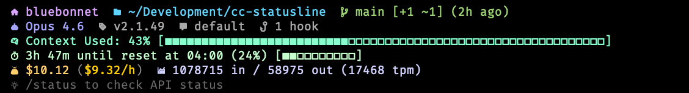

# Claude Code Statusline

Custom statusline for Claude Code displaying session information, git status, and helpful tips. Uses [Nerd Font](https://www.nerdfonts.com/) icons for a clean, consistent look.

Based on [cc-statusline](https://github.com/chongdashu/cc-statusline) by [@chongdashu](https://github.com/chongdashu).

> **Requires a [Nerd Font](https://www.nerdfonts.com/font-downloads)** (e.g. FiraCode Nerd Font) set as your terminal font.

## Installation

Download the script to your `~/.claude` directory and make it executable:

```bash
curl -o ~/.claude/statusline.sh https://raw.githubusercontent.com/mmasters/cc-statusline/refs/heads/main/statusline.sh
chmod +x ~/.claude/statusline.sh
```

Then add the following to your `~/.claude/settings.json`:

```json
{
  "statusLine": {
    "type": "command",
    "command": "~/.claude/statusline.sh",
    "padding": 0
  }
}
```

## Layout

The statusline displays 6 lines:



## Line 1: Hostname, Directory & Git

| Icon | Nerd Font | Codepoint | Description |
|------|-----------|-----------|-------------|
| `` | nf-fa-home | `f015` | Computer hostname |
| `` | nf-fa-folder | `f07b` | Current working directory |
| `` | nf-dev-git_branch | `e725` | Git branch name |
| | | | `[+N ~N -N ●N]` Uncommitted changes |
| | | | `↑N ↓N` Commits ahead/behind remote |
| | | | `(Xh ago)` Time since last commit |
| `󰆗` | nf-md-content_save | `f0197` | Stash count |

## Line 2: Environment

| Icon | Nerd Font | Codepoint | Description |
|------|-----------|-----------|-------------|
| `󱜙` | nf-md-robot_happy | `f1719` | Model name (Opus 4.6, Sonnet, Haiku) |
| `󱈤` | nf-md-tag_text | `f1224` | Claude Code version |
| `󰅺` | nf-md-comment | `f017a` | Output style (default, concise, verbose) |
| `󱘖` | nf-md-connection | `f1616` | MCP servers count |
| `󰛢` | nf-md-link_variant | `f06e2` | Hooks count |

## Line 3: Context Usage

| Icon | Nerd Font | Codepoint | Description |
|------|-----------|-----------|-------------|
| `󰧑` | nf-md-brain | `f09d1` | Context used percentage with 60-char progress bar |
| | | | `■` = used, `□` = remaining |

**Colors change based on context used:**
- Mint green: ≤50% used
- Peach: 51-70% used
- Coral red: ≥71% used

## Line 4: Session Timer

| Icon | Nerd Font | Codepoint | Description |
|------|-----------|-----------|-------------|
| `󰔛` | nf-md-timer_outline | `f051b` | Time until next session reset |
| | | | `(N%)` Session usage percentage |
| | | | 10-char session progress bar |

## Line 5: Cost & Tokens

| Icon | Nerd Font | Codepoint | Description |
|------|-----------|-----------|-------------|
| `󰴮` | nf-md-sack | `f0d2e` | Total session cost in USD |
| | | | `($X/h)` Burn rate (cost per hour) |
| `󰄧` | nf-md-chart_bar | `f0127` | Token split: input / output |
| | | | `(N tpm)` Tokens per minute |

## Line 6: Tips

| Icon | Nerd Font | Codepoint | Description |
|------|-----------|-----------|-------------|
| `󰛩` | nf-md-lightbulb_on_outline | `f06e9` | Random tip, rotates every minute |

## Customization

### Colors

Color functions are defined near the top of the script:

```bash
host_color()       # 38;5;183 - soft pink/mauve
dir_color()        # 38;5;117 - sky blue
git_color()        # 38;5;150 - soft green
model_color()      # 38;5;147 - light purple
version_color()    # 38;5;180 - soft yellow
cc_version_color() # 38;5;249 - light gray
context_color()    # 38;5;158 - mint green (dynamic)
usage_color()      # 38;5;189 - lavender
cost_color()       # 38;5;222 - light gold
burn_color()       # 38;5;220 - bright gold
tip_color()        # 38;5;243 - dim gray
```

### Progress Bar

To change the progress bar width, edit line ~375:

```bash
context_bar=$(progress_bar "$context_used_pct" 60)  # Change 60 to desired width
```

Also update the fallback on the next line with matching empty squares.

### Progress Bar Characters

To change fill/empty characters, edit the `progress_bar` function (~line 50):

```bash
for ((i=0; i<filled; i++)); do printf '■'; done   # Filled character
for ((i=0; i<empty; i++)); do printf '□'; done    # Empty character
```

### Tips

Tips array starts around line 430. Add or remove tips as needed:

```bash
tips=(
  "Your tip here"
  ...
)
```

Tips rotate based on: `$(date +%s) / 60 % ${#tips[@]}`
- Change `60` to adjust rotation speed (seconds)

### Adding New Elements

1. **Extract data** in the appropriate section (jq for JSON, grep for bash fallback)
2. **Add display** in the render section using printf
3. **Use color functions** for consistent styling

### Data Sources

| Data | Source |
|------|--------|
| Directory, model, context, cost, tokens | Piped JSON from Claude Code |
| Hostname | `hostname` command |
| Git info | Direct git commands |
| MCP servers, hooks | `~/.claude/settings.json` |

## Dependencies

- `jq` (optional, has bash fallback)
- `git` (for git features)

